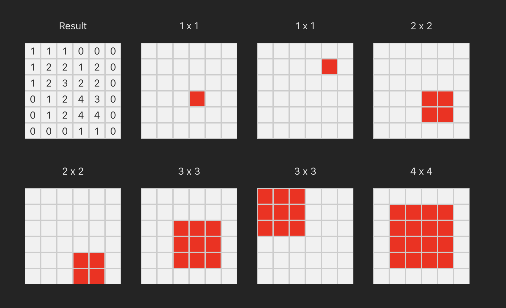

# Alex's Games Client

Currently this is a client for select puzzles from 最强大脑 (The Biggest Brain)

## Puzzles

### Grid Puzzle

S11E03 @ 16:45ish - https://youtu.be/DWWATa2CkW8?t=1000
Rules:
- 6x6 Grid
- You can place 7 squares of different sizes (two each of 1x1, 2x2, 3x3, and one 4x4)
- You need to find a combination of squares that match the 'heatmap' of the supplied grid
- The heatmap is a 6x6 grid with different symbols in each cell
- Symbols are as follows, note: **Some symbols are ambiguous**:
  - ⚔: Empty _[NB: currently displays as '0']_
  - 🔺: Covered by either 1 or 3 squares _[NB: currently displays as '1']_
  - 🔵: Covered by either 0 or 2 squares _[NB: currently displays as '2']_
  - 🌲: Covered by 4 squares _[NB: currently displays as '4']_

# Development Setup

## Prerequisites

- The [game server project](https://github.com/abradner/zqdn_games) running locally
- Node 20.14.0 or later
- Yarn 4.4.0 or later
- Probably a few things I've forgotten

## Installation

1. Clone the repository
2. Copy .env.example to .env and update the values as needed
3. Run `yarn install` to install dependencies
4. Run `yarn run dev` to start the development server

# Contributing

1. Fork the repository
2. Follow the code style and conventions
3. Create a new PR from your fork, tagging me (@abradner) for review
